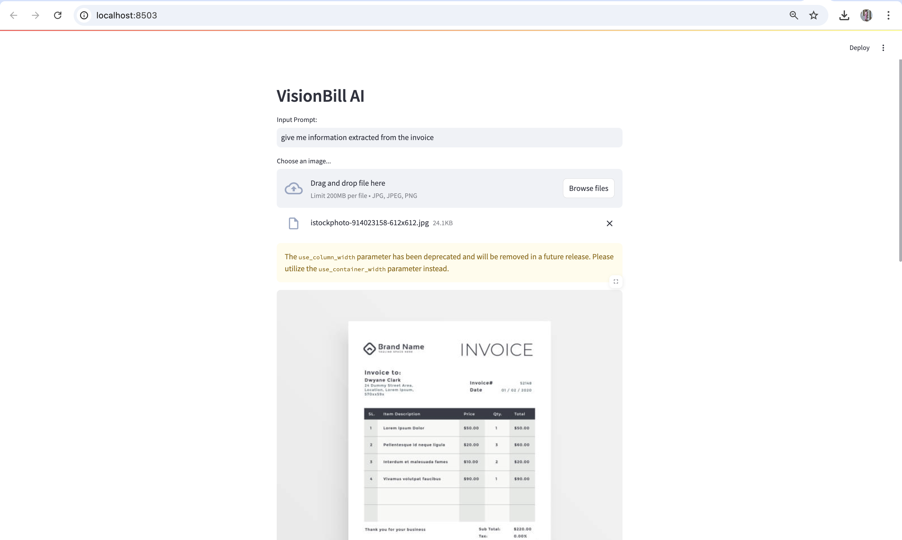
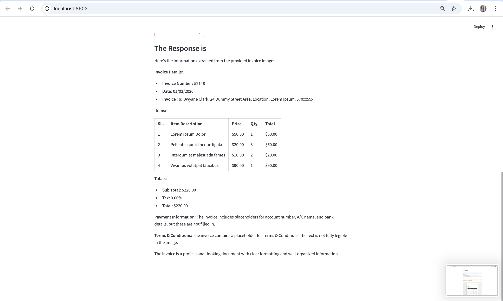
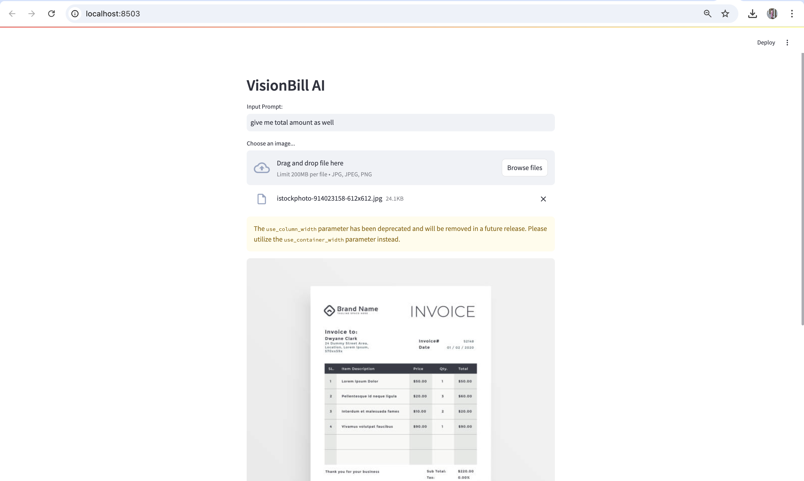
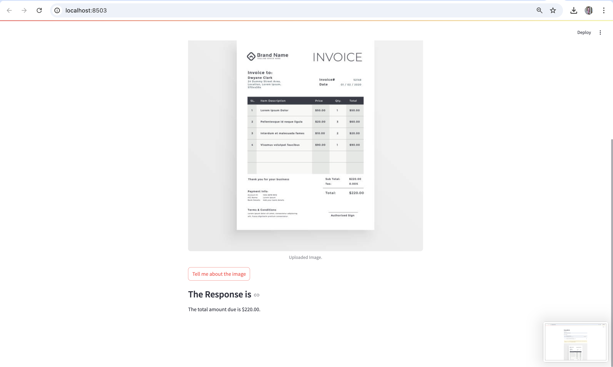

# InvoSense - AI-Powered Invoice Understanding

## 🚀 Overview
**InvoSense** is an AI-powered invoice understanding system that leverages Google's Gemini AI to analyze and extract insights from invoices. This project allows users to upload invoice images and get structured information using advanced machine learning models.



## 🎯 Features
- ✅ **AI-Powered Invoice Analysis** using Google's Gemini API.
- ✅ **Image Upload Support** for processing invoices.
- ✅ **Streamlit Web Interface** for user-friendly interactions.
- ✅ **Automated Text Extraction** from invoices.
- ✅ **Fast & Accurate Processing** of financial documents.

## 🛠 Tech Stack
- **Frontend:** Streamlit (Python)
- **Backend:** Google Gemini Pro Vision API (Now upgraded to Gemini 1.5 Flash)
- **Libraries:**
  - `google-generativeai`
  - `streamlit`
  - `PIL (Pillow)`
  - `dotenv`
  - `os`

## 📦 Installation
1. Clone this repository:
   ```bash
   git clone https://github.com/yourusername/InvoSense.git
   cd InvoSense
   ```
2. Create and activate a virtual environment:
   ```bash
   python -m venv venv
   source venv/bin/activate  # On Windows use: venv\Scripts\activate
   ```
3. Install dependencies:
   ```bash
   pip install -r requirements.txt
   ```
4. Set up your API Key:
   - Create a `.env` file in the project root.
   - Add your Google API key:
     ```
     GOOGLE_API_KEY=your_google_api_key
     ```

## ▶️ Usage
Run the Streamlit app:
```bash
streamlit run app.py
```

## 🖼 How It Works
1. Upload an invoice image (`.jpg`, `.jpeg`, `.png`).
2. Click the **'Tell me about the image'** button.
3. The AI will analyze and extract relevant information.
4. View the structured output in the response section.

## ⚠️ Common Issues & Fixes
### 1. **Gemini 1.0 Pro Vision Deprecated**
- **Solution**: Update your code to use `gemini-1.5-flash` instead of `gemini-pro-vision`.
  ```python
  model = genai.GenerativeModel('gemini-1.5-flash')
  ```

### 2. **Unsupported Backend 'sox_io' in torchaudio**
- **Solution**: Use the supported backend:
  ```python
  waveform, sample_rate = torchaudio.load("audio.wav", backend="soundfile")
  ```


## 📜 License
This project is licensed under the **MIT License**.

## 🤝 Contributing
Pull requests are welcome! Feel free to improve the project or add new features.

## 🌟 Acknowledgments
- **Google Gemini AI** for powerful invoice analysis.
- **Streamlit** for the interactive UI.
- **Open-source contributors** for continuous improvements.

---
**🚀 Made with ❤️ using AI!**

